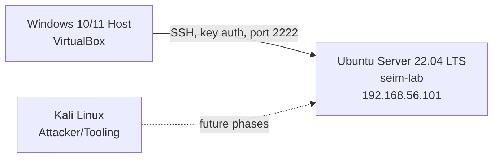

# Linux Hardening Lab CIS Benchmark Implementation

Ubuntu Server 22.04 hardened to a CIS Benchmark Level 1 baseline across all 15 phases. Lynis auditing, PAM password policy, SSH key-based access control, kernel-level sysctl hardening, automated security patching, auditd, AIDE, AppArmor, and a fully automated hardening script. Real troubleshooting incidents documented, not edited out including a full VM rebuild after a GRUB misconfiguration. See `hardening-log.md` and the [final report](reports/hardening-report.md).

## Lab Details

| Field          | Details                     |
|----------------|------------------------------|
| Author         | Hammad Khan                 |
| Start Date     | July 2, 2026                |
| Last Updated   | July 18, 2026                |
| Status         | ✅ Complete — all 15 phases  |
| Baseline Score | 57 / 100 (Lynis)             |
| Final Score    | 79 / 100 (Lynis) — +22 points |

## Lab Architecture

## Infrastructure

| Component       | Details                                                   |
|-----------------|-------------------------------------------------------------|
| Target System   | Ubuntu Server 22.04 LTS (192.168.56.101, hostname: seim-lab) |
| Hypervisor      | VirtualBox                                                 |
| Access Method   | SSH, ed25519 key-based auth, custom port 2222              |

## Phase Status

| # | Phase                              | Status         |
|---|--------------------------------------|----------------|
| 1 | Baseline Assessment                 | ✅ Complete     |
| 2 | Filesystem Hardening                | ✅ Complete     |
| 3 | Software and Updates                | ✅ Complete     |
| 4 | Process Hardening                   | ✅ Complete     |
| 5 | SSH Hardening                       | ✅ Complete     |
| 6 | Password Policy                     | ✅ Complete (lockout via fail2ban, not pam_faillock) |
| 7 | User and Group Security             | ✅ Complete     |
| 8 | Auditd Configuration                | ✅ Complete     |
| 9 | Network Hardening                   | ✅ Complete     |
| 10 | File Integrity Monitoring (AIDE)   | ✅ Complete     |
| 11 | AppArmor                           | ✅ Complete     |
| 12 | Login Banners and Warnings         | ✅ Complete     |
| 13 | Final Lynis Scan                   | ✅ Complete — Score: 79/100 |
| 14 | Automated Hardening Script         | ✅ Complete     |
| 15 | Professional Report                | ✅ Complete     |

## CIS Benchmark Controls Implemented

Full detail in `benchmarks/cis-controls-implemented.md`. Summary:

| Control Area                       | CIS Reference     | Status |
|--------------------------------------|--------------------|--------|
| /tmp noexec, nosuid, nodev            | 1.1.2.x            | ✅ |
| Unused filesystem modules disabled    | 1.1.1.x            | ✅ |
| /proc hidepid                         | Hardening addition | ✅ |
| Automatic security updates            | 1.9                | ✅ |
| SSH root login disabled, key-only auth| 5.2.x              | ✅ |
| ASLR / kernel sysctl hardening        | Kernel hardening   | ✅ |
| Password aging (90/7/14 days)         | 5.4.1.x            | ✅ |
| Password complexity (pwquality)       | 5.3.1              | ✅ |
| Account lockout (fail2ban)            | 5.3.2              | ✅ |
| User/group audit, su restriction      | 5.6, 6.2.x         | ✅ |
| Auditd rules + immutable mode         | 4.1.x              | ✅ |
| Network sysctl hardening + UFW        | 3.x                | ✅ |
| File integrity monitoring (AIDE)      | 1.4.x              | ✅ |
| AppArmor (65 profiles enforced)       | 1.6.x              | ✅ |
| Login banners (console, network, SSH) | 1.7.x              | ✅ |
| GRUB bootloader password              | BOOT-5122          | ✅ |

## Repository Structure
linux-hardening-lab/
├── benchmarks/
│   └── cis-controls-implemented.md       # CIS Benchmarks mapping
├── configs/
│   ├── aide/                              # AIDE integrity checking configs (Phase 10)
│   ├── apparmor/                          # AppArmor.d security profiles (Phase 11)
│   ├── auditd/                            # auditd.conf & hardening.rules (Phase 8)
│   ├── banners/                           # Custom issue, issue.net, & motd (Phase 12)
│   ├── network/                           # Sysctl hardening & UFW rules (Phase 9)
│   ├── password-policy/                   # login.defs, pwquality, & common-auth (Phase 6)
│   ├── process-hardening/                 # 99-hardening.conf & limits.conf (Phase 4)
│   ├── software-updates/                  # Unattended-upgrades configurations (Phase 3)
│   ├── ssh/                               # Hardened sshd_config & cloud-init (Phase 5)
│   └── user-security/                     # Secure sudoers & pam.d/su configurations (Phase 7)
├── lynis-reports/                         # Pre- and post-hardening scan results
├── notes/
│   └── command-log.md                     # Full step-by-step technical reference log
├── reports/
│   └── hardening-report.md                # Final professional audit report (Phase 15)
├── screenshots/
│   ├── github/                            # 67 proof-of-work captures across all 15 phases
│   └── handbook/                          # Teaching-evidence and conceptual screenshots
├── scripts/
│   └── harden-ubuntu.sh                   # Automated, idempotent hardening script (Phase 14)
└── hardening-log.md                       # Chronological project log & incident records

## Real Incidents Documented

This lab documents what went wrong, not just what worked.

| Incident                                          | Phase | Resolution |
|----------------------------------------------------|-------|------------|
| Lynis report not captured via `tee`                 | 1     | Read /var/log/lynis.log directly instead |
| squashfs dependency conflict with snap              | 2     | Verified with `snap list`, documented exception |
| SSH cloud-init config override                      | 5     | Found and fixed via `sshd -T` effective-config check |
| Leading-space grep bug in pwquality.conf            | 6     | Diagnosed and corrected grep pattern |
| pam_faillock misconfiguration broke sudo/su entirely | 6     | Recovered via GRUB recovery mode, reverted faulty PAM lines |
| log_martians reset by network service at boot        | 9, 13 | Added systemd unit to reapply after network-online.target |
| GRUB password lockout + full disk loss on recovery    | 13    | Full VM rebuild from own documentation; corrected with `--unrestricted` |

Full detail: `hardening-log.md` (narrative) and `notes/command-log.md` (command-by-command).

## Tools and Technologies

Lynis · AIDE · Auditd · UFW · fail2ban · AppArmor · CIS Ubuntu 22.04 LTS Benchmark · MITRE ATT&CK · Ubuntu Server 22.04 · VirtualBox · Git/GitHub

## Final Report

The complete professional report Executive Summary, Methodology, Before/After comparison, Risk Reduction Analysis, and the full rebuild incident narrative is available at [`reports/hardening-report.md`](reports/hardening-report.md).

## Project Status

All 15 phases complete. Lynis Hardening Index improved from **57 to 79** (+22 points), including a full mid-project VM rebuild after a documented incident, with all controls re-verified from scratch.

Part of a complete cybersecurity portfolio built command by command in a real lab environment.

**GitHub:** [github.com/HK101-cyber](https://github.com/HK101-cyber)
**LinkedIn:** [hammad-khan-sec](https://www.linkedin.com/in/hammad-khan-sec)
**TryHackMe:** [PentesterHK](https://tryhackme.com/p/PentesterHK)
**LetsDefend:** [HK101cyber](https://app.letsdefend.io/user/HK101cyber)
