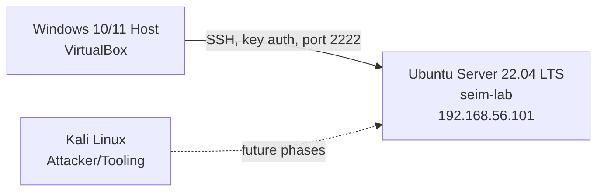

# Linux Hardening Lab — CIS Benchmark Implementation

Ubuntu Server 22.04 hardened toward a CIS Benchmark Level 1 baseline, one control at a time. Lynis auditing, PAM password policy, SSH key-based access control, kernel-level sysctl hardening, automated security patching. Real troubleshooting incidents documented, not edited out — see `hardening-log.md`.

## Lab Details

| Field          | Details                     |
|----------------|------------------------------|
| Author         | Hammad Khan                 |
| Start Date     | July 2, 2026                |
| Last Updated   | July 5, 2026                |
| Status         | Phase 6 of 15 in progress   |
| Baseline Score | 57 / 100 (Lynis) — Final: 79 / 100            |

## Lab Architecture

## Infrastructure

| Component       | Details                                                   |
|-----------------|-------------------------------------------------------------|
| Target System   | Ubuntu Server 22.04 LTS (192.168.56.101, hostname: seim-lab) |
| Hypervisor      | VirtualBox                                                 |
| Access Method   | SSH, ed25519 key-based auth, custom port 2222              |
| Co-located Labs | ELK SIEM (Project 1) and Splunk (Project 2) — both live on this same VM |

## Phase Status

| # | Phase                              | Status         |
|---|--------------------------------------|----------------|
| 1 | Baseline Assessment                 | ✅ Complete     |
| 2 | Filesystem Hardening                | ✅ Complete     |
| 3 | Software and Updates                | ✅ Complete     |
| 4 | Process Hardening                   | ✅ Complete     |
| 5 | SSH Hardening                       | ✅ Complete     |
| 6 | Password Policy                     | 🔄 In Progress  |
| 7 | User and Group Security             | ✅ Complete     |
| 8 | Auditd Configuration                | ✅ Complete     |
| 9 | Network Hardening                   | ✅ Complete     |
| 10 | File Integrity Monitoring (AIDE)   | ✅ Complete     |
| 11 | AppArmor                           | ✅ Complete     |
| 12 | Login Banners and Warnings         | ✅ Complete     |
| 13 | Final Lynis Scan                   | ✅ Complete     |
| 14 | Automated Hardening Script         | ⬜ Not Started  |
| 15 | Professional Report                | ⬜ Not Started  |

## CIS Benchmark Controls Implemented

Full detail in `benchmarks/cis-controls-implemented.md`. Summary:

| Control Area                       | CIS Reference     | Status |
|--------------------------------------|--------------------|--------|
| /tmp noexec, nosuid, nodev            | 1.1.2.x            | ✅ |
| Unused filesystem modules disabled    | 1.1.1.x            | ✅ |
| /proc hidepid                         | Hardening addition | ✅ |
| Automatic security updates            | 1.9                | ✅ |
| SSH root login disabled, key-only auth| 5.2.x              | ✅ |
| ASLR / kernel sysctl hardening        | Kernel hardening   | ✅ |
| Password aging (90/7/14 days)         | 5.4.1.x            | ✅ |
| Password complexity (pwquality)       | 5.3.1              | ✅ |
| Account lockout (faillock)            | 5.3.2              | 🔄 Being redone — see hardening-log.md |

## Repository Structure
linux-hardening-lab/
├── configs/
│   ├── ssh/                  # sshd_config, cloud-init override (Phase 5)
│   ├── password-policy/      # login.defs, pwquality.conf, faillock.conf, common-auth (Phase 6)
│   ├── process-hardening/    # 99-hardening.conf, limits.conf (Phase 4)
│   └── software-updates/     # unattended-upgrades configs (Phase 3)
├── lynis-reports/            # Baseline scan (before-hardening). After-scan pending Phase 13.
├── notes/
│   └── command-log.md        # Personal command-by-command reference log
├── screenshots/
│   └── github/                # Proof-of-work screenshots — currently Phases 1-2, more pending transfer
├── benchmarks/
│   └── cis-controls-implemented.md
├── reports/
│   └── hardening-report.md   # Placeholder — completed in Phase 15
├── scripts/                   # Reserved for automated hardening script — Phase 14
└── hardening-log.md            # Chronological project log, including incidents

## Real Incidents Documented

This lab documents what went wrong, not just what worked.

| Incident                                          | Phase | Resolution |
|----------------------------------------------------|-------|------------|
| Lynis report not captured via `tee`                 | 1     | Read /var/log/lynis.log directly instead |
| squashfs dependency conflict with snap              | 2     | Verified with `snap list`, documented exception |
| SSH cloud-init config override                      | 5     | Found and fixed via `sshd -T` effective-config check |
| Leading-space grep bug in pwquality.conf            | 6     | Diagnosed and corrected grep pattern |
| pam_faillock misconfiguration broke sudo/su entirely | 6     | Recovered via GRUB recovery mode, reverted faulty PAM lines |

Full detail: `hardening-log.md` (narrative) and `notes/command-log.md` (command-by-command).

## Tools and Technologies

Lynis · AIDE (upcoming) · Auditd (upcoming) · UFW (upcoming) · CIS Ubuntu 22.04 LTS Benchmark · MITRE ATT&CK · Ubuntu Server 22.04 · VirtualBox · Git/GitHub

## Coming Next

Phase 7 — User and Group Security
Phase 8 — Auditd Configuration
Phase 9 — Network Hardening (UFW rules accounting for co-located Splunk/ELK ports)

Part of a complete cybersecurity portfolio built command by command in a real lab environment.

**GitHub:** [github.com/HK101-cyber](https://github.com/HK101-cyber)
