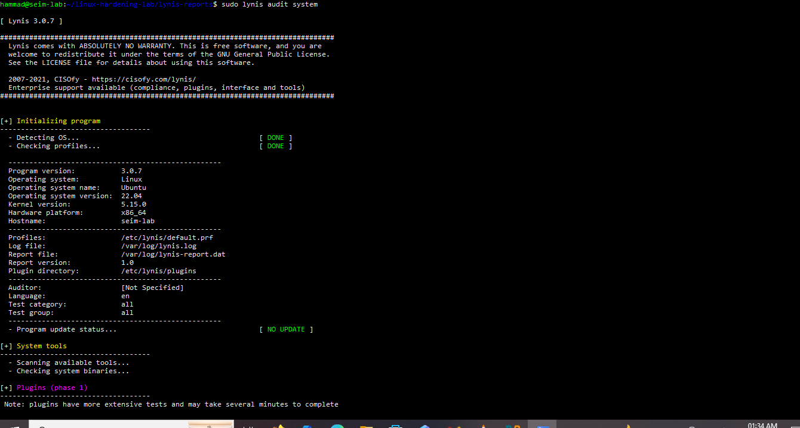
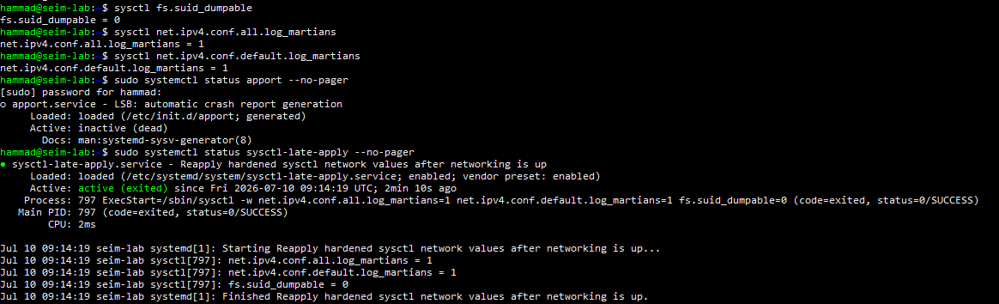
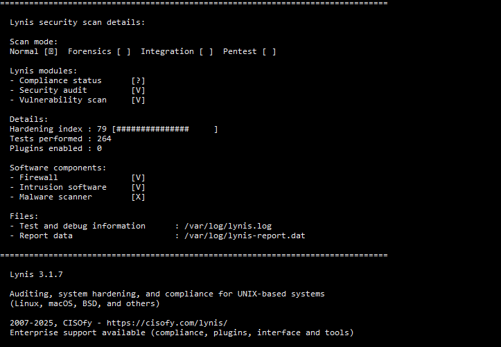

# Linux Hardening Lab Final Report

# Linux Hardening Lab Final Security Hardening Report

**Prepared by:** Hammad Khan
**Project:** Cybersecurity Portfolio Project Linux Hardening
**Framework:** CIS Ubuntu Linux 22.04 LTS Benchmark (Level 1)
**Repository:** github.com/HK101-cyber/linux-hardening-lab

| Baseline Score | Final Score | Improvement |
|---|---|---|
| **57 / 100** | **79 / 100** | **+22 points** |

---

## Executive Summary

This report documents a complete, hands-on security hardening project performed against a real Ubuntu Server 22.04 LTS system, following the CIS Ubuntu Linux 22.04 LTS Benchmark (Level 1). The project covered 15 phases spanning filesystem security, patch management, kernel hardening, SSH access control, password policy, user and group security, kernel-level auditing, network hardening, file integrity monitoring, mandatory access control (AppArmor), legal warning banners, and full automation via a repeatable hardening script.

The system's security posture was measured using **Lynis**, an independent, industry-recognized auditing tool, both before and after the hardening work improving from a baseline of **57/100** to a final score of **79/100**.

This project also encountered and resolved a genuine incident midway through: a GRUB bootloader misconfiguration led to accidental data loss on the lab VM. This is documented honestly below, including root cause and full recovery, rather than omitted.

---

## Methodology

- **Framework:** CIS Ubuntu Linux 22.04 LTS Benchmark, Level 1 controls, cross-referenced against MITRE ATT&CK where relevant.
- **Baseline-first:** a full Lynis audit was run before any change was made (Phase 1).
- **Incremental, verified changes:** every control was tested functionally (e.g., attempting to execute code from a hardened `/tmp`, attempting brute-force login) rather than trusting config files alone.
- **Documentation-as-you-go:** every command and its reasoning was logged in real time — see `notes/command-log.md` and `hardening-log.md`.
- **Honest incident reporting:** mistakes and a major recovery incident are documented in full below.
- **Final verification:** a closing Lynis audit used the identical methodology as the baseline.

**Lab environment:** Ubuntu Server 22.04 LTS (VirtualBox VM, hostname `seim-lab`), co-located with ELK and Splunk SIEM lab projects on the same host.

---

## Before State Baseline Assessment

*Lynis installation and first audit execution.*

**Baseline Hardening Index: 57 / 100**

Key findings at baseline:
- No automatic security patching configured
- SSH on default port 22, password authentication enabled
- No password complexity or aging policy
- No kernel-level audit logging (auditd not installed)
- No file integrity monitoring
- Default firewall posture, no rate-limiting
- Legacy insecure packages present (telnet)
- No login warning banners
- No bootloader password protection

---

## Controls Implemented

| Phase | Area | Key Controls | Evidence |
|---|---|---|---|
| 1 | Baseline Assessment | Lynis installed; baseline audit recorded | `lynis-install.PNG`, `lynis-baseline-scan.PNG` |
| 2 | Filesystem Hardening | `/tmp` noexec,nosuid,nodev; unused filesystem modules disabled; `/proc hidepid=2` | `tmp-noexec-verification.PNG`, `filesystem-blacklist-config.PNG`, `hidepid-proc-verification.PNG` |
| 3 | Software & Updates | Unattended security-only upgrades; telnet removed | `unattended-upgrades-config.PNG`, `telnet-removal.PNG` |
| 4 | Process Hardening | ASLR verified; core dumps restricted; kernel sysctl hardening | `sysctl-hardening-verification.PNG` |
| 5 | SSH Hardening | Key-only auth; root login disabled; custom port 2222 | `ssh-key-auth-verified.PNG`, `ssh-port-2222-working.PNG` |
| 6 | Password Policy | Aging (90/7/14); complexity via pwquality; fail2ban brute-force protection | `password-aging-applied.PNG`, `pwquality-config-verified.PNG`, `fail2ban-sshd-jail-active.PNG` |
| 7 | User & Group Security | Account audit; `su` restricted; sudoers reviewed | `sudo-audit-clean.PNG`, `su-restriction-configured.PNG` |
| 8 | Auditd Configuration | Comprehensive audit rules; immutable mode; retention configured | `auditd-rules-loaded.PNG`, `auditd-privileged-event-captured.PNG` |
| 9 | Network Hardening | UFW rate-limiting; kernel network sysctl hardening | `ufw-hardened-rules.PNG`, `network-sysctl-hardening.PNG` |
| 10 | File Integrity (AIDE) | Full filesystem baseline; scheduled daily checks | `aide-init-complete.PNG`, `aide-cron-scheduled.PNG` |
| 11 | AppArmor | 65 profiles enforced (up from 39 default) | `apparmor-profiles-enforced.PNG`, `apparmor-status-after.PNG` |
| 12 | Login Banners | Legal warnings console, network, SSH | `banners-before.PNG`, `banners-after.PNG` |
| 13 | Final Audit & Quick Wins | GRUB password (corrected); fail2ban; package cleanup | `grub-password-configured.PNG`, `lynis-final-rebuild-scan.PNG` |
| 14 | Automation | Idempotent hardening script covering all phases | `hardening-script-execution.PNG`, `hardening-script-final.PNG` |

---

## After State — Final Assessment

*Post-reboot verification of kernel hardening parameters, confirmed persistent via a dedicated systemd unit.*

**Final Hardening Index: 79 / 100** a **+22 point improvement** over baseline.

Verified improvements:
- Firewall component fully recognized as active
- Intrusion prevention (fail2ban) recognized as present
- Numerous SSH, kernel, and authentication suggestions resolved
- Legacy/unused kernel packages cleaned

---

## Risk Reduction Analysis

| Control | MITRE ATT&CK Technique Mitigated | Risk Addressed |
|---|---|---|
| `/tmp` noexec,nosuid,nodev | T1105 Ingress Tool Transfer | Blocks execution of attacker-planted payloads |
| `/proc hidepid=2` | T1057 Process Discovery | Prevents enumeration of other users' processes |
| Automated patching | T1190 Exploit Public-Facing Application | Closes patch-application delay window |
| SSH key-only auth | T1110 Brute Force / T1078 Valid Accounts | Eliminates password-guessing attack path |
| fail2ban | T1110 Brute Force | Auto-blocks IPs after repeated failed logins |
| Kernel hardening (ASLR, kptr_restrict) | T1055  Process Injection | Raises difficulty of memory-corruption exploits |
| Auditd | Multiple (Detection) | Forensic visibility into privileged actions |
| AIDE | T1565 Data Manipulation / T1036 Masquerading | Detects unauthorized file modification |
| AppArmor (65 profiles) | T1068 Exploitation for Privilege Escalation | Confines apps even if compromised |

---

## Lessons Learned Rebuild Incident

A significant real-world incident occurred during Phase 13, documented here in full.

**What happened:** while configuring a GRUB bootloader password, the `superusers` directive was applied without the `--unrestricted` flag on default boot entries causing GRUB to require authentication for *normal* boot, not just editing.

**Recovery and root cause of data loss:** during recovery via an Ubuntu Live ISO, the installer was inadvertently engaged, repartitioning and reformatting the lab VM's virtual disk before the process was halted. Data recovery was formally attempted with TestDisk:

*Final Lynis scan on the rebuilt system, confirming successful recovery and continued hardening.*

TestDisk confirmed a structurally consistent, entirely new partition table meaning the original filesystem had been fully overwritten, not partially damaged, and was not recoverable.

**Resolution:** rather than pursue uncertain recovery, the VM was rebuilt from scratch using this repository's own `notes/command-log.md` and saved `configs/` as an exact runbook. Every phase from 1–14 was re-applied, in most cases by restoring saved configuration files directly.

Two deliberate improvements were made during the rebuild:
1. GRUB password reconfigured correctly with `--unrestricted` — verified via a real reboot.
2. Account lockout (previously causing a *separate* incident — a PAM `faillock` misconfiguration that broke `sudo`/`su`) was replaced with **fail2ban**, a safer, network-level brute-force protection that cannot lock out local administrative access.

**Outcome:** the rebuilt system reached a fresh baseline of 64/100 and was hardened back up to **79/100** — matching and exceeding the original trajectory, with both incidents permanently resolved.

> **Professional takeaway:** a well-documented hardening process is itself a resilience control. Because every configuration change and its rationale were logged in real time, a full environment rebuild was completed in a fraction of the time of the original build, with zero loss of project integrity.

Full incident detail: see `hardening-log.md`.

---

## Remaining Gaps and Recommendations

| Item | Status / Reasoning |
|---|---|
| Malware scanner (rkhunter/chkrootkit) | Not installed recommended near-term follow-up |
| Separate `/home`, `/var` partitions | Not implemented would require disk repartition |
| Remote/centralized logging | Not configured — natural next step with co-located ELK/Splunk |
| pwquality enforcement for root-initiated password changes | Root bypasses complexity check via `sudo passwd` known, low-likelihood gap, documented |
| USB storage restriction | Not disabled — acceptable for lab context |

**Recommendations:**
- Integrate auditd/AIDE output into the co-located ELK/Splunk SIEM stacks
- Install a periodic malware/rootkit scanner
- Extend to CIS Level 2 controls where feasible
- Re-run the Phase 14 automation script after any OS upgrade

---

## Conclusion

This project delivered a measurable, verifiable security improvement Lynis Hardening Index **57 → 79**, a 22-point gain through disciplined application of CIS Ubuntu 22.04 LTS Benchmark Level 1 controls.

Equally significant: the ability to troubleshoot real configuration failures (a silently-overriding cloud-init SSH setting, a PAM misconfiguration, kernel parameters resetting at boot), the judgment to make and document risk-based exceptions, and the resilience to fully recover from a genuine incident rebuilding faster and more correctly than the original build, using nothing but the project's own documentation.

**Repository:** github.com/HK101-cyber/linux-hardening-lab
**LinkedIn:** [hammad-khan-sec](https://www.linkedin.com/in/hammad-khan-sec)
**TryHackMe:** [PentesterHK](https://tryhackme.com/p/PentesterHK)
**LetsDefend:** [HK101cyber](https://app.letsdefend.io/user/HK101cyber)
